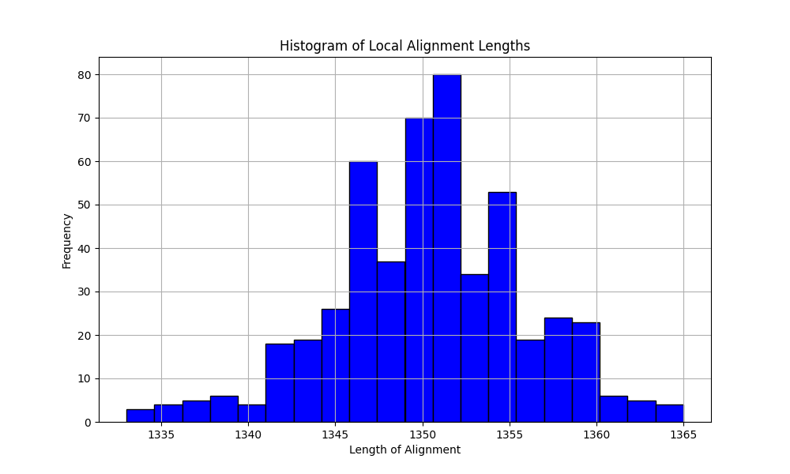
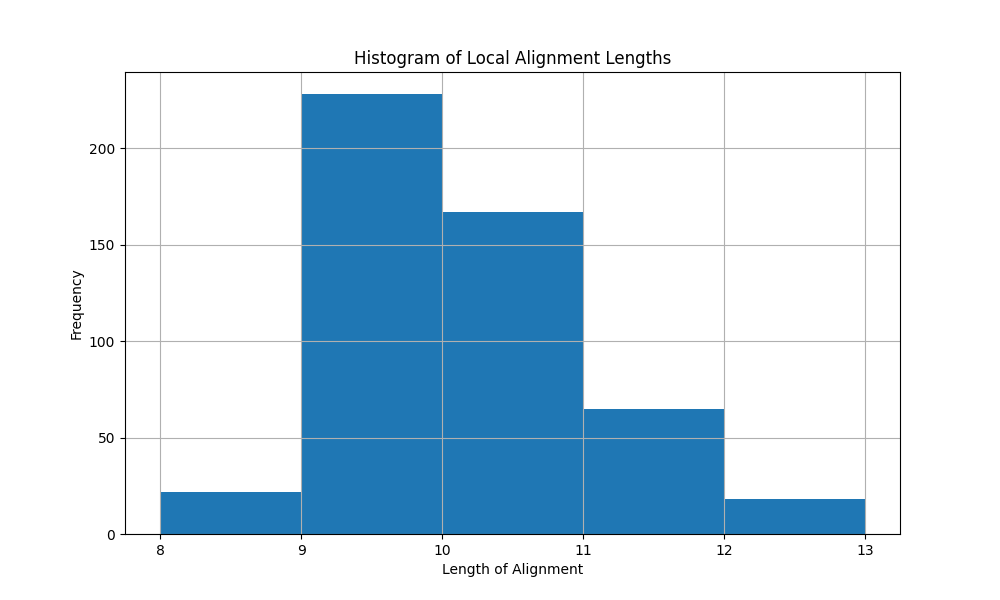

# BIMM182
### Q2
To generate random sequences and align them with given parameters, run AlignSequences.py:

`python3 AlignSequences.py <number of pairs> <length of seq> -m <match> -s <mismatch> -d <indel>`

>Ran `python3 AlignSequences.py 500 1000 -m 1 -s -30 -d 0 -o Para1.txt` for first set of parameters. 

>Ran `python3 AlignSequences.py 500 1000 -m 1 -s -30 -d -20 -o Para2.txt` for the second set.

The output files, `Para1.txt` and `Para2.txt` are the collections of lengths of alignments for each random pair. The data is used to generate histogram.

To plot histogram, run `python3 PlotHist.py <length_file.txt> -b <bin size>`, remember to change the filename accordingly. The script reads the output file that contains the alignment lengths.

The first set of parameters:
`python3 PlotHist.py Para1.txt -b 20`

The second set of parameters:
`python3 PlotHist.py Para2.txt -b 5`

