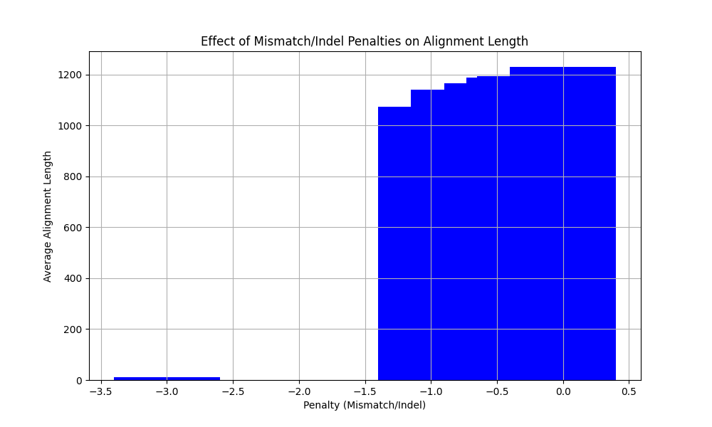

# BIMM182 Assignment 2
### Q1
To run the program:

`python3 locAL.py <seq files> -m <match> -s <mismatch> -d <indel> -a`, where `-a` option prints out the alignment itself.

Example usage:

>`python3 locAL.py p1seqs.fasta -m 1 -s -10 -d -1 -a`

Output:
```
Alignment:
CCTA-AAACCACTCCGCAGA-AAAAGAATAAGGCCAAAA-CACGAC-TA--A-AATCGAAAGACATGAC-AAGT-AAA-CGAG-A-AAA-GA-AAA-AT-A-AA-CGACATACACACTTGTAGGA--A-A--A-ATAA-GAAA-A-AGGGGGAGACGAAGCAAAGAAAGGGC-AGCTAACCCT-CAAGG-A---AG-AACCAGACAG-AATAAGAA--A-AACCC---GAAA-GCCACCAAATG--AAA-G-GACA-ATAACACCTAAGA-GCAAAATC-AAT-AAAACACC----GAT---CCTCCGAGG-A-T-AACCA-AGA-G---A-GAC--CTAAGAACGACAA-GA--AACC-AATGA--A--AGA-A-AA--AGA---AAATGGACATCA-G----AACGACTTA-GAATGCTGGGA-AA-AA-GAAAAATTAT-----AAACG-AA-G-G-AT-G-G---GC-A-TAAATTG-G--ACG-AAG-C-CAAG-AGAT-AG-GC-CGA--GAT-AAAACGGAGAACAATAAG-G--GAGAC-C--ATGGAGAG--CAAACCAACC----GCAA-CAAAT--AA-AGGGGGG-GACAAAA-ACAAGACCAAC--CC-AAA-CT-GT-CA-GACAGG-A--A-G-----AGC-AATAAC--CAAGACA-GAAG-AA-GAAACAGG-AGA-CAAAC-A-AC--AT--AAT-AT--A-AGAGC-A-CCTAGCTAACAAAAAAGA---CCAGCAAACGGATTAAGA-AGAT--AAAGAAAACGT----AAA-----G--AACAG--T----C-AAG---GAACAAGCGA----TAATAA-ATGCA-GG-GAAAAAAT-GG-G--GA-CAG-ACGAAGGAAA--CAACCA-G-AAATAATCTAACGCATCGCAGAAGAT-GACACTGCGA--GAAAATACGAG-CCGTATAC-GACAC-A-AAAC--C--G--GGAATA-AAGA-A-AA---AAACCATAC-CCAAA-AAG-A-ACAAC-G--CGAAAGATGAAAC-GCTCCCAACT---CGGATG-AGCAAAGCC-GCC-AGGCC--A--AA--A-AAG-AGAAC-CAGAG-CAGA--GCGAAG--CT-A-TG-GGTAGAA-AA-C-ACCCTAAG-C--G-CGGGT-AGTAGAGAC--GAAAA-A-TAA-AAACAGG-C-TGACC-CGAACAT-AAGAGCCCACACAAGTAGAAGAACGGAAAGAAAACGAAAAGA
CC-AGAAACCA-T-C-C---TAAAAG---AAGG---AAAGCA--A-ATAGGAGAA-C-AAA-ACA--A-TAA-TCAAAGCGA-TATAAAGGAGAAACATAACAACCG-C-TACAC-C----A--ATCACACCACA-AAGGAAAGATA-----AG-C---GCAAAG--A--G-AAG-T-ACCCTGC-A--TACCTA-CAACCA-A-A-TAA-AAG-AGGAGAA--CTGAGAAACGCCACCAAA--ACAAACGTGAC-GAT-A-A-CT-A-ATG--AAA-CGAATGAAAA-A--GGAGGATAGACCT-C-A--AATTCAA--AGAGATGAACATGACAGCTAA-AA-GACAACGAGCAA--AAATG-CTAGGAGACATAACCA-AGCTAAA--GAC--CAGGACCCAACGAC---CGAA--C---G-CAAGAATG-AAAATTA-GCCCCAAA--AAACGCGCA-CGAGAAAG-AACTAAA--GAGCCAC-AAAGACACAA-TAGA-AAGTGCTCGACGGA-CAAAA---A-AA-AA-AA-AGAAGAGACACAAAT--AGA-AACAAA--AA-CAAAAG-AAGCAAA-CGAATA------TGAC-AAAGA-AA-ACCAACTACCAAAAGC-AGTACATGACA--CATCATGCACACAGCGAA-AACAACAA-A-ATGAA-CAACGAAA-A--CA-ACCAAA-AAGACGAATCGAA-CA-GGAGAGAG-GATCC---C---CAAAAAAGAGGGCC--C-AAC----TAAGACA-ATGCAAAG-AAACG-CGACAAAGCCTCGCCAACAGAATCAACCAAAGCATGAAC-AGC-ACTTTTAA-AACATG--TGGCG-------CGGCGTCGAGCAGTAC---GG---TTCAA--ATGCAAA-AAT-T-A--CA----A-AA-A-AGACA-TGC-ACTG---A-AC---CCCGTA-A-AGA-ACGAGAAACTTCAAGAAGG-A-AGAAGACATAAGCCAAA--A-A-ACCAAATAA-TAGAC-ACAGCTCG--AGA--AAA-AG--CCCAAC-AAAC-GA--CAG-AAA---AG--AAGG--GGAGTAAGGAGAAGCA-AA-ACAGA-ACAG-GGGCG-AGAAC-GACTGCGG-AG--TAATCGA----AAGACATGAC----AAGTA-A-ACGAGAAAAGATTAATAAAC--GACAT-A-CAC-AA-A-CAA-A----A-ACAA-TAG-A-AAC-GAAA-AAAA--AAAA-A
Score of the best local alignment: 119.0
Length of the best local alignment: 1247
```

### Q2
To generate 500 pairs (1000 in total) of sequences of length 1000, run:

`python3 randomDNA.py 1000 1000 -o 500pairs_random.txt`

Output:
```
jiayic@Jiayis-MBP BIMM182_A2 % python3 randomDNA.py 1000 1000 -o 500pairs_random.txt
A: 0.2503
T: 0.2502
C: 0.2491
G: 0.2505
```

To generate random sequences and align them with given parameters, run AlignSequences.py:

`python3 AlignSequences.py <number of pairs> <length of seq> -m <match> -s <mismatch> -d <indel>`

>Ran `python3 AlignSequences.py 500 1000 -m 1 -s -30 -d 0 -o Para1.txt` for the first set of parameters. 

>Ran `python3 AlignSequences.py 500 1000 -m 1 -s -30 -d -20 -o Para2.txt` for the second set.

The output files (`length_file.txt`), `Para1.txt` and `Para2.txt` are the collections of lengths of alignments for each random pair. The data is used to generate histogram.

To plot histogram, run `python3 PlotHist.py <length_file.txt> -b <number of bins>`. The script reads the output file that contains the alignment lengths.

The first set of parameters:
`python3 PlotHist.py Para1.txt -b 20`


The second set of parameters:
`python3 PlotHist.py Para2.txt -b 5`


The lengths of the optimal local alignments are different. 
For the first set of parameters, the lack of a penalty for introducing gaps allows the alignment to extend by adding gaps, thus increasing the length of the alignment. The resulting alignments might include several gaps that separate islands of matches. Therefore, even in sequences with low similarity,  mismatches can be avoided by adding gaps to improve the score.

With parameter2, the large indel penalty makes the algorithm conservative about introducing gaps. This tends to produce shorter alignments with fewer or no gaps. The algorithm will often terminate an alignment segment instead of introducing a gap or continuing through a mismatch to keep the alignment score high.

Tried Parameter1: 
```
500 pairs length 20, alignment length median/average = 27

500 pairs length 200, alignment length median/average = 271

500 pairs length 600, alignment length median/average = 812

500 pairs length 1000, alignment length median/average = 1350
```
From Excel, `l_p1(n)` is a linear function `y - 1.35x + 0.72`, with `R^2=1`, where x is random sequence length, y is alignment length


Tried Parameter2: 

>500 pairs length 20, alignment length median/average = 4.5

>500 pairs length 200, alignment length median/average = 7.2

>500 pairs length 600, alignment length median/average = 8.2

>500 pairs length 1000, alignment length median/average = 10

From Excel, `l_p2(n)` is a linear function `y = 0.005x + 5.21`, with `R^2=0.8939`, where x is random sequence length, y is alignment length


#### Extra Credit:
Parameter1: the slope of 1.35 means that the alignment length (y) grows faster than the sequence length (x). This attributes to 0 gap penalty that allows even distant matches to contribute to the same local alignment block

Parameter2: the slope of 0.05 indicates a much slower rate of increase in alignment length with increasing sequence length. The high penalties for both mismatches and indels mean that only the strongest matching segments contribute to the optimal local alignment. As sequence length increases, the addition to alignment length is minimal because most potential alignment extensions would incur penalties that outweigh their benefits.

### Q3
#### a)
`python3 length_function.py <a list of indel/mismatch parameters to try, separated by space>`

For this problem, ran `python3 length_function.py -3 -1 -0.75 -0.5 -0.33 -0.25 0`

Found an abrupt change occurs at -1 to 0


#### b)
To zoom in, tried `python3 length_function.py -3 -1 -0.75 -0.5 -0.33 -0.25 0`

The abrupt change occurs at around -1.38 penalty.


#### Extra Credit:
For high penalties, mismatches and indels are discouraged to keep high alignment score. The algorithm favors very short and high-confidence alignments that have good matchings. The abrupt change occurs when the cost of introducing a mismatch or a gap is outweighed by the benefit of continuing the alignment. It's at this threshold where the algorithm shifts from a conservative to a more permissive behavior.

### Q4
To save memory, did not keep the entire scoring matrix. Used two rows to compute scores: `prev_score_row` and `curr_score_row`. For traceback puspose, also used two rows (`prev_length_row` and `curr_length_row`) to compute the length of alignment that reaches each cell in the "matrix". 

Stored 1) the highest score, 2) the coordinates on the two sequences that generates the highest score, and 3) the length of alignment that produced the highest score.

With the coordinates and the length of alignment, it is possible to reconstruct the alignment.

Sliced the sequences. Starting from the coordinates, trace n bases backwards, where n = length of alignment.

Since the sliced sequences are much shorter. It is possible to run locAL.py that computes and stores the entire scoring matrix, which makes backtracking straightforward.

To run local alignment on the sliced sequences, `from locAL import LocalAlignment` function.

---
To run the linear space local alignment program,
`python3 Linear_locAL.py p4seqs.fasta -m 1 -s -10 -d -1 -a`

While the program is running, use following command to show <span style="color:blue"> memory usage. </span>

Space complexity for <span style="color:red">  **linear space local alignment**. </span>

```
jiayic@Jiayis-MBP BIMM182_A2 % ps aux | grep locAL.py

jiayic           27653  99.3  0.3 409760336  21072 s020  R+    6:12PM   0:45.14 /Library/Frameworks/Python.framework/Versions/3.12/Resources/Python.app/Contents/MacOS/Python Linear_locAL.py p4seqs.fasta -m 1 -s -10 -d -1 -a

jiayic@Jiayis-MBP BIMM182_A2 % ps -o pid,rss,vsz,comm -p 27653

  PID    RSS      VSZ COMM
27653  11712 409891408 /Library/Frameworks/Python.framework/Versions/3.12/Resour
```
Space complexity for <span style="color:red">  **2D scoring matrix local alignment**. </span>

```
jiayic@Jiayis-MBP BIMM182_A2 % ps aux | grep locAL   
jiayic           37233 100.0 11.2 420182608 942656 s019  R+    9:17PM   0:18.75 /Library/Frameworks/Python.framework/Versions/3.12/Resources/Python.app/Contents/MacOS/Python locAL.py p4seqs.fasta -m 1 -s -10 -d -1 -a

jiayic@Jiayis-MBP BIMM182_A2 % ps -o pid,rss,vsz,comm -p 37233
  PID    RSS      VSZ COMM
37233 454112 420923984 /Library/Frameworks/Python.framework/Versions/3.12/Resources/Python.app/Contents/MacOS/P

```
Running result:
```
jiayic@Jiayis-MBP BIMM182_A2 %  python3 Linear_locAL.py p4seqs.fasta -m 1 -s -10 -d -1 -a
Alignment:
TGTCCTACGC-TAG--CC-GC-TA-ATGGT-ATCGAAC--CCTG-TGTTTCCCGCGAGCAATCGTTA--TGAGCGA-TGG---GACCTCATCCCGGATTAGGATACTTCACGCTTACGAACTCTCAGGGAC--AGTTCCG
TGT-CTAC-CATA-TACCTG-GT-CAT-GTGA-C-AACAGCC--ATG-TT--C-CGAG---T-G---GCTGAGCG-CT--TTCGACCTCATCCCGGATTAGGATACTTCACGCTTACGAACTCTCAGGGACAGAGTTCCG
Score of the best local alignment: 56
Length of the best local alignment: 140
```

#### Extra Credit
Use flag `-t` to show running time.
`python3 Linear_locAL.py p5pairs.fasta -m 1 -s -10 -d -1 -a -t`
Sequences 1-5 are fast, 6 is slower. Started too late, did not have time to finish sequence 7. It has been running for 6 hours.

Output for p5pairs.fasta:
<details>

```
python3 Linear_locAL.py p5pairs.fasta -m 1 -s -10 -d -1 -a -t
Pair 1:
Score of the best local alignment: 4
Length of the best local alignment: 4
Alignment:
ACAA
ACAA
Pair 2:
Score of the best local alignment: 37
Length of the best local alignment: 53
Alignment:
ACCAAAAAAA--CGAACCAA-AACACATCTTCGGATGGAA-GTAAGGGAAATA
ACC--AAAAACCCGAACC-AGAACACATCTTCGGATGG-ACGTAAGGGAAATA
Pair 3:
Score of the best local alignment: 485
Length of the best local alignment: 505
Alignment:
GGTCAAAGGAGGAAAAA--AA-TACAACCATGAGAAAAGAAAAGAAAAGAATACAATAAACGACAAAGTAAATTCGACTGATCAACTATGCCAAAAAGTAGGTAGGAAAGGGAAAAACACAAGAAAAA--AAAAAACCGAAACAAGAAACGAAATAAGAAAGCTCAAAGAGAACCAAAATAAAAATAGTAGAAACAGCATTACGAACAATAGTGGAGGAGTAACAAAAATCTAGGATGAAAGCGAAAGACAAAAAAAACTACACGCAATAAAAGCAACTGGCCCATAACATCAAAAAAGGAGATGAAAAGGTTAAACGAAAAGCAGGAAAAACTAAAAAACCGTAATGGTAAACAGCAGGTAAAAAACCCAGCGCATACAGACAGAGACAAATGCACCTCCACGACACACAGTGAAACCGTCCCGTCACTATGCGAAAGCCAAGATTCAGTGCAATAAACAACAACAATTCCTAAAACAAAGGTGGACCGACTAACAGCCCGAAC
GGTCAAAGGAGG---AACCAAGTACAACCATGAGAAAAGAAAAGAAAAGAATACAATAAACGACAAAGTAAATTCGACTGATCAACTATGCCAAAAAGTAGGTAGGAAAGGGAAAAACACAAG--AAATTAAAAAACCGAAACAAGAAACGAAATAAGAAAGCTCAAAGAGAACCAAAATAAAAATAGTAGAAACAGCATTACGAACAATAGTGGAGGAGTAACAAAAATCTAGGATGAAAGCGAAAGACAAAAAAAACTACACGCAATAAAAGCAACTGGCCCATAACATCAAAAAAGGAGATGAAAAGGTTAAACGAAAAGCAGGAAAAACTAAAAAACCGTAATGGTAAACAGCAGGTAAAAAACCCAGCGCATACAGACAGAGACAAATGCACCTCCACGACACACAGTGAAACCGTCCCGTCACTATGCGAAAGCCAAGATTCAGTGCAATAAACAACAACAATTCCTAAAACAAAGGTGGACCGACTAACAGCCCGAAC
Pair 4:
Score of the best local alignment: 985
Length of the best local alignment: 1005
Alignment:
ACCAGATCGGAAGAGAGGCTACAGGGCGAAGAAAAACTACACAACCAGAAAAGACCAAAAGACCGATTATAGTAAAGCAAAGCTGGCGTGACGGGTCAGACCCAGCCTCTGCGGGGTGATGAAATCTCAAAGTGGAAACACAACACAAGATAAAAAA-AAAAACCAAAAAAAAATGGTTTAAACAGGGAACCATAAAAAACAATATAGCTCCTAGCGAGAGAAGATAAATACGCACACGATTAGGGA-CGGTGGAGATAAGAAAACACAAAACAAGCAAA--GTATAGGAACAAAATCAGAAA-GTCACACCACACAGAAACAAAAAAAACCCTGCAAAAGAAAGAGTAAGCACTTTAAGTCTGGACCAAAGAGGCCACACACTGAGACAACATAAAGTAACCAAAATCACCGACTTAGGAAGATAACGAACCCAACAACAGACCACGGGAAAACCAACCCAGAACTGAAATTGACCACGGACCAATAACGAGCAGGAGCAGGGCAACATGAGTAAAAAGAGAAAACCAATAAAAGTCAACAACCTAATCAAACAAGGGGCAAGAGATGCCAACGGAAATAACGTCCAGAAAAGCAAGCGAGCAAGACAAAGAATGACACGGAATAAACCACGAAGCAATGCAGGCCGCAAACCCGCACGAGGTAGACAAGTAATGAGTAATACATTAAAAGAGCGAGAGCCAAACTAAGAGAAAGGGATTTCTAGCGATAGACAGAGAGGAAGAAAGGCCCACAGGTCAGTCCGGGCAAAGAAGAAATAAAATATGAGACCAGATCCAGGGACATGTACCGCGACATGATTAACAAGAATAGGAAAATACAGAGACCAAACGAAATCGAAGGAAAATTATAAATAACCACAAAACGTGAACAACGAAAAAGACTATAAGCACTGAAAAAAGACGAACAAAAGATCTGCGTACAGAACTAAAGAAACAAGGTACGGGGCCAAACGAAGAGATTGAAGAGCACCCACGAGACGCAC
ACCAGATCGGAAGAGAGGCTACAGGGCGAAGAAAAACTACACAACCAGAAAAGACCAAAAGACCGATTATAGTAAAGCAAAGCTGGCGTGACGGGTCAGACCCAGCCTCTGCGGGGTGATGAAATCTCAAAGTGGAAACACAACACAAGAT-AAAAACAAAAACCAAAAAAAAATGGTTTAAACAGGGAACCATAAAAAACAATATAGCTCCTAGCGAGAGAAGATAAATACGCACACGATTAGGG-CCGGTGGAGATAAGAAAACACAAAACAAGC--AGGGTATAGGAACAAAATCAG-AATGTCACACCACACAGAAACAAAAAAAACCCTGCAAAAGAAAGAGTAAGCACTTTAAGTCTGGACCAAAGAGGCCACACACTGAGACAACATAAAGTAACCAAAATCACCGACTTAGGAAGATAACGAACCCAACAACAGACCACGGGAAAACCAACCCAGAACTGAAATTGACCACGGACCAATAACGAGCAGGAGCAGGGCAACATGAGTAAAAAGAGAAAACCAATAAAAGTCAACAACCTAATCAAACAAGGGGCAAGAGATGCCAACGGAAATAACGTCCAGAAAAGCAAGCGAGCAAGACAAAGAATGACACGGAATAAACCACGAAGCAATGCAGGCCGCAAACCCGCACGAGGTAGACAAGTAATGAGTAATACATTAAAAGAGCGAGAGCCAAACTAAGAGAAAGGGATTTCTAGCGATAGACAGAGAGGAAGAAAGGCCCACAGGTCAGTCCGGGCAAAGAAGAAATAAAATATGAGACCAGATCCAGGGACATGTACCGCGACATGATTAACAAGAATAGGAAAATACAGAGACCAAACGAAATCGAAGGAAAATTATAAATAACCACAAAACGTGAACAACGAAAAAGACTATAAGCACTGAAAAAAGACGAACAAAAGATCTGCGTACAGAACTAAAGAAACAAGGTACGGGGCCAAACGAAGAGATTGAAGAGCACCCACGAGACGCAC
Pair 5:
Score of the best local alignment: 4985
Length of the best local alignment: 5005
Alignment:
AAAGACACAAATAAAGATAAGACGTACAAATCACAGAAGGGAAATACAGCAATGGGAGTCAAATGAGAACACTGCACCAAA-AACACAAATAAGAACAGCGAGCATGACAAAAAAATAACAGAAGGGGAATAAAAACAGCGGCGAAGAGAAGAAAGCGACGTGGGAGTAGTAAAAAGGGAGCAAAAGACATTTAACAAGAGAAGACCAACAACCAAAGTATCAAAAGGGCAAATAGAAGCCTCCAATCACACCGACCCGGAAACACCACAACAGCAGAAAAACGACGAAAAAGGACCGACAGACGGATAAACCAGGATCATAGACGAAAATGGACCAGAGAAGGAAATACAAGAGTACTGCAAAACCAAGAAGATTAATAGAATGAGAATAATCAGTAAGGCAAAAAATGACGTACAAAAAGGCACCACCAAAATACGAGGGTGAAGGCAGAAAAATAAAGACAGAACAAACCCACAAACAGACCCAGCTGCAACCTCGAACAAAGGAAAAACACAGCACAAAAAAACAGCAAGTCGGATAGCACCGCAAAACCAAGAGAAATCAAAGCGACACTGACAAAGAGCTACCCTAACAGGCCGAGAATCATTAAAAACGGGTACCCGCAAAGAAGCGAAAGCAGAAAGCACGGGAAAATGAAGAAGCCATATACATAATACAGCGAGCAAAACCGAGAAAAAAACCATAGGGACCCTTACAAAAGTAAATAAAAGGAGAGCGAATCCTTAAAAGAAAACAGCTACGTAGTATAGCATTAAACCGGAGACCTTCCAGACTTGGGAAAAAGGCAAAACAAAAAAGACAAATGACCACCCACAAAAGACAGACAAAAAACGGAGAAAAACCCGCATATCGAACAAGCAAAATACATACCACAGAGAACCGTCGAACTTATACAAAAAAAATAAAAGACGAAATTAGCGAGAAGGGGAGAACCACAAACACAAACAAAAAACCGAGGAAAGGACGCATACAGGATCAAATGAAAAAGAGACCAAAAATTGAGAAACACAAACAAAAATGCAAAACGAGAGAGGACCAACAAATAAAGTAAAGACTGAATAACTACAAGAACACAGCTCCCGTTTAGAACACCCGAACAAACTAAACACGCCCAAATATAGTACTGGAAAAAACAAAAAGGTAAACTTATATTTCAAAAATAACGAGATATACGCGACGAAACAAAAGGCAACACTACGAAACCCATAAAGGCAAAAGATCGCGGCTAGAGGCACACTCAAGAAACAAGAATTAAGCGACAATAAAGAAGATACCGAAAAAGAAAAAAACAAAATGCGTTGAAACTGACGACCAGGAACGAAAGTGCAAAACAATCAGGAACCAGGCACAGACAAGCAGAAAACAAACGACGAACGAGACTAGTAGGGAGCAACCCTAACACAAGGACTAGAGAAGTACATAACAACTAACGAACCACACGACATAAATAGGAAACCAAAGATACACAGGAAGTACAAGATGAGCCAACGAGCCATTGACAAAAAAAAAAACACAGAGGTAACTACACAACAAGAAGCATAGGGGACTAAAAACAAAACATAAAAACAGCACAAGATAATGAAAAAAGAACTTAAACGAACATAAGATAGAATTCGATAAAAAGAGAAAAGAAAAAAGCGATAAAAAACGCTTGCGCAACGCCGAGGTATCACCTAAGAACACTGACCGAAAAAAGCGCAAGAGGAACCACCAACATCAAACGACAGAACAGCACAGAAA--GCAGGAACACCAGAACTGTGACTGAATAACACCCGGGAAA-AAAAGAGAATGGAAACCAAA-CAACGAGAGGTCATAAAATAAACTGGTAAAAAAGACCAAAGGAGAATAAGAATAATAGACAACATGAGAACTAACGATACAGAATAAATTAGAAACAGAATAACAAACAACCGCAAAGGATAACGCCATAAACGGGGAAGCGAGGAATCAAAAAGAAATCACCCGATCTACAGAAATCGAGGTTAGAAAAAAAGAAGAAGAAAAGAAGATGGCCAAACAAAAGCTCAGATTCCGAATCACATAAACATGAAGACCATGGACCGAAAAGCTAGGACATCACACGACAATCCATCACAAACTCAATCACCTCGAAGCAAAACACCAAAAAAGATAGGAACAAGACGCTGCGGAATAGGAACCACAAAAAACACCAACCCGCAAGAGAACCATTCCAAATGGAGGAGTGGAATAAGGAAAAGAAAGCAAAAAAAAAAAGGGGACTCTACGACCACCACGCAAACACAGCAGGGAATGGAGTGACAGACGCCCAGGTCAAGTCGGAAGAAACAAAAACGTAAAAGAACGTAAAATGCCGCAGGTACGACATCAGCCATACAAAGAGAGTAAAAAAACAATGAACGCAGAGTAAATCAGAAGAATAAGGAAGCACAAACCAGCGAACGAACACATAGGGGCAAACCCGAGTTCCCGACAAGTAGACCTAACAAAAAAAAGGAACTGCAAGTGACAGTCCAACCCAACGCCAATGTGGGTAACAAGCAAGAAAGGGCGAAAAACCGACGAGATTAAAAAGCGAGACCCAATGGGCCGGCAGGAAGCGAAAGAAAGCAACATAGTACGTACGAAAGCAAGACTTTAGAAAGAAACAGGCGGTCAGCAATAGGCAAAGTAGAAACAGAGAAGACACCAAACAGACACAGAAACCGCCATGTATGCAAAACAATGAAAAAGACTATAGTCCAAGACCAAAATATCGAGAACGAATCAACTCGGCCAGGAAAAAACAAAAAAAAACAGCACTAAGAAGAGAAAAATGGAATCCCCCAGACTAGAAACTGAAACGAGGACACCGAGACATCAAACAACAACCGAGGAAAAGGGAACGGCAAATAAGAAAATACCTAAGGGAGAAGTGAAGAGTAACAGAAGAAAGCAAGCTGACGAAAAAACAAGCTAGTAACCAACCGTTGGCGCAAGAACCCACACAAGCCGAAAACACCAGCAAAAGACCGAAAACGCGAAAACCATAAAACCCCAATAGCGTCAATTTCGACACCCCAGTAAGCTACAAAAATCTTGACAACAATTCTACAAAAAGACAATAAAACGAGAACAAGGGCACCGAAAAAAATAAAAGATACAGGAGACAAAAAGTCAACTACACTAACTCATTAAAACAACCCGAATTAGAACGAAAAGGAAACGGCAAAGGAGCAAAAAACCGGAAGGCACTACAGACGTCGGGAAAACTTCGAAACAACAGAACACGAGAAGAGGAGGGAAATGAGAAAACAAAAAAAGATCGAGGTCGCACATCAATGAAGCTAGAAGACCGGACCCCAAAGAAACTTATAAAGCAACAGGCCCCATCTAAAGTAAAAAGTATACCAATAAAACTAAGTCATTATAAAAGCATAACGAGGTGTAAAAGCGAAGACACAAAACAAAACAGAAAAGTAAGGCAAGGGGGCCAGGAAGCCCTGAGGGGGGCGAAAATGAAGAAACACAACGCGCAGAGCGTGGATAGAAAGACATCATAAAGCAGAGCGACAAAAAATAAAAAACCAATTGAGAACTACGAAAGCTAGAGCTACCGGAGAAAGGATGCAAAAACACAAACCGAACCGGCTACGGAACATTTCGAGAAGATCAACAAACCAGCGCAAGTACAGACCCGGAAAGAAGCGCACAGAGATAACTGGAATACAGTCATTAAACAGGCAGAAAAAGACAAGCTAAAACCAAAGGAGAAAAGAGAAAAGAAGGAAAACGAAAGAAACCCGAAACCGCAGCAATACTCGTAGACTGATAAGCCGTATGACAACCACCGAAAAAAATGACTAAGCGGACCAAAAAATCCTCTCAACGCGACGCAGAAAAAAAAGCAAAGTCCAAGAAAGAAAGACAAGCTAAGGGGAAGGCAGAAGAGCAAAAAAAAAGACACCTGGAAGATCGACAGATATACATCAAGTAAAGAAAAACAAGGACATAAACTGCAGTCCGCAGATCATCTCGCAAGCCGGGGAAAAGTGGGAGACCAGAGCATAAGAGAGTTCAGAAGAAGCAAAAAATTAATTACAAAAAAAGGGAAAGAAACCATAGAAGAGAAAAGAAAAAACAAAAAGCGGAAATAGCAAAAAAGGGATGAAGCCAAACCAAACAGAAAAATAACAACAAAACCGATAAGAACCAAAGAAGAAAATAGACGGAGAGACTAAGAAAAACATCGAGCGGAGAGCAGTAGAAAGTCCGAGAGGCTAACCGATAATGAAAAAGAAGTACCCACGCCAACAAGTCATCCAAAAACTGAAAAATGGGTAATAGAAAAACGGCTGAATTCCAAAATGATGACCATTGAAACCAAGCTAAAGTGCGCCACGAAAAAAAGGCAAGCGCATCGATAACGGAACTCCAGTCCAAAAGTAAAAAGAAAAACAAAAACCACAAGAAATCCACGACTTCACCAACACGCTCAAAAACACCCGAACAGAATTTAACAAAAAGATGGAAGACTGAAACCAGGCCTATAGTGGGCACACATCAAGGAACAGAATCGGAAGCCGCCCCAGAAAAAAACAGAGTCCAATAGCCTACAAGAAAGAAGAGAACAAGACCACCATGATAACAGCAGTAAATAAGAGGAACAAAGCGGCAAGACAACAACAAGAAAAAGAAAGGGCCGAAAAAGGGAACATAAAAAACGACCACCTACAAACATGAGACAAGCACGAAAAGACAAGGAACAGCATACACACGAGTCAGAAAAAAAGGTAACAAAGCACGAGTCACAACCAAGAACAAACCAGGGGAGGGGAAAGATGGGAAAGAAAAAGACCCAGGAAACGAACAAAAATAAACACAAAAATGGTAGGAAAGACAACAAGACAACGGCCATTACAAAAAAACGCCATCCTCGGGAAGGGGTAGGAAAGAACCAAAAAAGACAAGGAAAGATGTAAACCAGGAAACAACAGTATAGGAACATGGAAGCAATAAAG
AAAGACACAAATAAAGATAAGACGTACAAATCACAGAAGGGAAATACAGCAATGGGAGTCAAATGAGAACACTGCACC-AACAACACAAATAAGAACAGCGAGCATGACAAAAAAATAACAGAAGGGGAATAAAAACAGCGGCGAAGAGAAGAAAGCGACGTGGGAGTAGTAAAAAGGGAGCAAAAGACATTTAACAAGAGAAGACCAACAACCAAAGTATCAAAAGGGCAAATAGAAGCCTCCAATCACACCGACCCGGAAACACCACAACAGCAGAAAAACGACGAAAAAGGACCGACAGACGGATAAACCAGGATCATAGACGAAAATGGACCAGAGAAGGAAATACAAGAGTACTGCAAAACCAAGAAGATTAATAGAATGAGAATAATCAGTAAGGCAAAAAATGACGTACAAAAAGGCACCACCAAAATACGAGGGTGAAGGCAGAAAAATAAAGACAGAACAAACCCACAAACAGACCCAGCTGCAACCTCGAACAAAGGAAAAACACAGCACAAAAAAACAGCAAGTCGGATAGCACCGCAAAACCAAGAGAAATCAAAGCGACACTGACAAAGAGCTACCCTAACAGGCCGAGAATCATTAAAAACGGGTACCCGCAAAGAAGCGAAAGCAGAAAGCACGGGAAAATGAAGAAGCCATATACATAATACAGCGAGCAAAACCGAGAAAAAAACCATAGGGACCCTTACAAAAGTAAATAAAAGGAGAGCGAATCCTTAAAAGAAAACAGCTACGTAGTATAGCATTAAACCGGAGACCTTCCAGACTTGGGAAAAAGGCAAAACAAAAAAGACAAATGACCACCCACAAAAGACAGACAAAAAACGGAGAAAAACCCGCATATCGAACAAGCAAAATACATACCACAGAGAACCGTCGAACTTATACAAAAAAAATAAAAGACGAAATTAGCGAGAAGGGGAGAACCACAAACACAAACAAAAAACCGAGGAAAGGACGCATACAGGATCAAATGAAAAAGAGACCAAAAATTGAGAAACACAAACAAAAATGCAAAACGAGAGAGGACCAACAAATAAAGTAAAGACTGAATAACTACAAGAACACAGCTCCCGTTTAGAACACCCGAACAAACTAAACACGCCCAAATATAGTACTGGAAAAAACAAAAAGGTAAACTTATATTTCAAAAATAACGAGATATACGCGACGAAACAAAAGGCAACACTACGAAACCCATAAAGGCAAAAGATCGCGGCTAGAGGCACACTCAAGAAACAAGAATTAAGCGACAATAAAGAAGATACCGAAAAAGAAAAAAACAAAATGCGTTGAAACTGACGACCAGGAACGAAAGTGCAAAACAATCAGGAACCAGGCACAGACAAGCAGAAAACAAACGACGAACGAGACTAGTAGGGAGCAACCCTAACACAAGGACTAGAGAAGTACATAACAACTAACGAACCACACGACATAAATAGGAAACCAAAGATACACAGGAAGTACAAGATGAGCCAACGAGCCATTGACAAAAAAAAAAACACAGAGGTAACTACACAACAAGAAGCATAGGGGACTAAAAACAAAACATAAAAACAGCACAAGATAATGAAAAAAGAACTTAAACGAACATAAGATAGAATTCGATAAAAAGAGAAAAGAAAAAAGCGATAAAAAACGCTTGCGCAACGCCGAGGTATCACCTAAGAACACTGACCGAAAAAAGCGCAAGAGGAACCACCAACATCAAACGACAGAACAGCACAG--ATCGCAGGAACACCAGAACTGTGACTGAATAACACCCGGG-AATAAAAGAGAATGGAAACC-AAGCAACGAGAGGTCATAAAATAAACTGGTAAAAAAGACCAAAGGAGAATAAGAATAATAGACAACATGAGAACTAACGATACAGAATAAATTAGAAACAGAATAACAAACAACCGCAAAGGATAACGCCATAAACGGGGAAGCGAGGAATCAAAAAGAAATCACCCGATCTACAGAAATCGAGGTTAGAAAAAAAGAAGAAGAAAAGAAGATGGCCAAACAAAAGCTCAGATTCCGAATCACATAAACATGAAGACCATGGACCGAAAAGCTAGGACATCACACGACAATCCATCACAAACTCAATCACCTCGAAGCAAAACACCAAAAAAGATAGGAACAAGACGCTGCGGAATAGGAACCACAAAAAACACCAACCCGCAAGAGAACCATTCCAAATGGAGGAGTGGAATAAGGAAAAGAAAGCAAAAAAAAAAAGGGGACTCTACGACCACCACGCAAACACAGCAGGGAATGGAGTGACAGACGCCCAGGTCAAGTCGGAAGAAACAAAAACGTAAAAGAACGTAAAATGCCGCAGGTACGACATCAGCCATACAAAGAGAGTAAAAAAACAATGAACGCAGAGTAAATCAGAAGAATAAGGAAGCACAAACCAGCGAACGAACACATAGGGGCAAACCCGAGTTCCCGACAAGTAGACCTAACAAAAAAAAGGAACTGCAAGTGACAGTCCAACCCAACGCCAATGTGGGTAACAAGCAAGAAAGGGCGAAAAACCGACGAGATTAAAAAGCGAGACCCAATGGGCCGGCAGGAAGCGAAAGAAAGCAACATAGTACGTACGAAAGCAAGACTTTAGAAAGAAACAGGCGGTCAGCAATAGGCAAAGTAGAAACAGAGAAGACACCAAACAGACACAGAAACCGCCATGTATGCAAAACAATGAAAAAGACTATAGTCCAAGACCAAAATATCGAGAACGAATCAACTCGGCCAGGAAAAAACAAAAAAAAACAGCACTAAGAAGAGAAAAATGGAATCCCCCAGACTAGAAACTGAAACGAGGACACCGAGACATCAAACAACAACCGAGGAAAAGGGAACGGCAAATAAGAAAATACCTAAGGGAGAAGTGAAGAGTAACAGAAGAAAGCAAGCTGACGAAAAAACAAGCTAGTAACCAACCGTTGGCGCAAGAACCCACACAAGCCGAAAACACCAGCAAAAGACCGAAAACGCGAAAACCATAAAACCCCAATAGCGTCAATTTCGACACCCCAGTAAGCTACAAAAATCTTGACAACAATTCTACAAAAAGACAATAAAACGAGAACAAGGGCACCGAAAAAAATAAAAGATACAGGAGACAAAAAGTCAACTACACTAACTCATTAAAACAACCCGAATTAGAACGAAAAGGAAACGGCAAAGGAGCAAAAAACCGGAAGGCACTACAGACGTCGGGAAAACTTCGAAACAACAGAACACGAGAAGAGGAGGGAAATGAGAAAACAAAAAAAGATCGAGGTCGCACATCAATGAAGCTAGAAGACCGGACCCCAAAGAAACTTATAAAGCAACAGGCCCCATCTAAAGTAAAAAGTATACCAATAAAACTAAGTCATTATAAAAGCATAACGAGGTGTAAAAGCGAAGACACAAAACAAAACAGAAAAGTAAGGCAAGGGGGCCAGGAAGCCCTGAGGGGGGCGAAAATGAAGAAACACAACGCGCAGAGCGTGGATAGAAAGACATCATAAAGCAGAGCGACAAAAAATAAAAAACCAATTGAGAACTACGAAAGCTAGAGCTACCGGAGAAAGGATGCAAAAACACAAACCGAACCGGCTACGGAACATTTCGAGAAGATCAACAAACCAGCGCAAGTACAGACCCGGAAAGAAGCGCACAGAGATAACTGGAATACAGTCATTAAACAGGCAGAAAAAGACAAGCTAAAACCAAAGGAGAAAAGAGAAAAGAAGGAAAACGAAAGAAACCCGAAACCGCAGCAATACTCGTAGACTGATAAGCCGTATGACAACCACCGAAAAAAATGACTAAGCGGACCAAAAAATCCTCTCAACGCGACGCAGAAAAAAAAGCAAAGTCCAAGAAAGAAAGACAAGCTAAGGGGAAGGCAGAAGAGCAAAAAAAAAGACACCTGGAAGATCGACAGATATACATCAAGTAAAGAAAAACAAGGACATAAACTGCAGTCCGCAGATCATCTCGCAAGCCGGGGAAAAGTGGGAGACCAGAGCATAAGAGAGTTCAGAAGAAGCAAAAAATTAATTACAAAAAAAGGGAAAGAAACCATAGAAGAGAAAAGAAAAAACAAAAAGCGGAAATAGCAAAAAAGGGATGAAGCCAAACCAAACAGAAAAATAACAACAAAACCGATAAGAACCAAAGAAGAAAATAGACGGAGAGACTAAGAAAAACATCGAGCGGAGAGCAGTAGAAAGTCCGAGAGGCTAACCGATAATGAAAAAGAAGTACCCACGCCAACAAGTCATCCAAAAACTGAAAAATGGGTAATAGAAAAACGGCTGAATTCCAAAATGATGACCATTGAAACCAAGCTAAAGTGCGCCACGAAAAAAAGGCAAGCGCATCGATAACGGAACTCCAGTCCAAAAGTAAAAAGAAAAACAAAAACCACAAGAAATCCACGACTTCACCAACACGCTCAAAAACACCCGAACAGAATTTAACAAAAAGATGGAAGACTGAAACCAGGCCTATAGTGGGCACACATCAAGGAACAGAATCGGAAGCCGCCCCAGAAAAAAACAGAGTCCAATAGCCTACAAGAAAGAAGAGAACAAGACCACCATGATAACAGCAGTAAATAAGAGGAACAAAGCGGCAAGACAACAACAAGAAAAAGAAAGGGCCGAAAAAGGGAACATAAAAAACGACCACCTACAAACATGAGACAAGCACGAAAAGACAAGGAACAGCATACACACGAGTCAGAAAAAAAGGTAACAAAGCACGAGTCACAACCAAGAACAAACCAGGGGAGGGGAAAGATGGGAAAGAAAAAGACCCAGGAAACGAACAAAAATAAACACAAAAATGGTAGGAAAGACAACAAGACAACGGCCATTACAAAAAAACGCCATCCTCGGGAAGGGGTAGGAAAGAACCAAAAAAGACAAGGAAAGATGTAAACCAGGAAACAACAGTATAGGAACATGGAAGCAATAAAG
Pair 6:
Score of the best local alignment: 9985
Length of the best local alignment: 10005
Alignment:
ATGAAAAGAAAACAAACCAATAAACAAAAAAACGGACTACAATGAAAAGAGAACCACAGCACAAAAAAAGCACCATCCAACATTAACATAACTAGCGATAAGTAAA--ACACCAGGCTATAGCAGAATGAGAGAACCCAGACATGGAAGATGGCAAAACCGCGGAAATGATGGAGAGCAAAAAATAGAGGCCACCAACAAAAAGAAAAAACACTAGGAGAAAGATGGCCACAAATTAAACCAACAAAGAACGATAATCCCGAAGAATCCAAAACACTACAAAAAAAGGAAACAAATAAAAACAATGATCCACGGGAAAAAACGAGTATGAATCGGCACACACAGACAAATAACAATCACGCCTAAACGCGAGCTGAACAAGAGGAAACTAGCAAAAATCAGGGGAATGCAAGAACCGATTCCAAGCTGAGACCCCGGACAATAAAGTCTAGAAAGATTTTAGCACCAAGATCTACATGAGAAATCAGAATAACGAGAACAAAACAAGAGTAAAGCAATAGCGTCACCGAAAGAAACGCGCTTCACAAAACCCCGTCTACCTAAGTGCACACTTATCAATCCAAGGACAGGAGCAAAGAAAACGAGGAATGTTGGAAAAAAATAAAAAGGACGAAGAGCGGAGCACCCACCTACAATAAAGAAAAGACAGAAAAGGAGGACGGTACACGACAACATACAAAAGCACAACAGCCAGCACCAAACGGACGAAGAACGCGACCCTCAGGGAGTCCACAAGACTAACGTTAAATCACAGGCGAGAACACACAAATCCAAAACATACGGAGTGTAGCAACGAACAAGGGAAAATACGAGAAAACAATCATACAAGTTGTAGCAAACGAAAGAGGGCCAGAATAAAAAAAAAGGAGACCAGAAGTCAACACCAGAGTAAATAAATAAGCGGAAAAAGAATCCCAGGGCCACCAATGAACGAGAACAGGCAAGTCAATGGATAAACACTCCAAGCAGAATATAAAGAACGCTGGAACGAAATGTAAAGTAAGGCAAATATTAACCTGATGACGAGAGAGCCAAAAACAACGGAAATCTAAACAAAAAGGCGAATGATAAAAAGTGAGACGGCAAAGCAAATAACCCGCACAATGAGGTGATAGGCACGCCAGAGCAGGAAGAAATAGAACCCGCCCAAGAACAGCAACATAAAAGCAACCACCAAACCAGGCCAGCAAGGAACAAGTAACAATATTATTAACTATAACGTAAATAGAAGAACAATTACCAAAACACTGCACCAACGAAGAAAGAACCAAAAAAAAATGGCAGACGGAAAAATGAGAAAAATGAGCCAAGGACCAGACGGCATAAAGGGAAACACTATTAAAATTATATCGAAACTAAGAAAGCATAAACTAGAAACACGAAGTAGAACAGAATGGGACAAACAAAAAAAAATGGCACGGGACGGCAGATAATAAACCACATGCACAAACCAAGAGACCAAGACAAGATCCAAGAACATACTTACGATACGACCGTCAGAGACGACATAGGCGTATGTAAACAAAGCACCGAAAACGCAGCCTAAGAACATATAAAAAAGGTGAAGTGGACTGTCGACGACACTAAGGGTAACCAGGCAATATCAGAGATCATGAAAACGGAGAAGAGGAAACTTGGAAATTAACGAGAGGCACGGATGGGGCACCAGAGTTAAGAGACCATCCCAAGTGGCGCATCAAAAGGATAAGGAAGCCAATCAAACATAGGAAACGACGAGTGGCAGAACGATGAAGGATATAGAACGATCAGCACGAATAAAAACAGAAAGATCACTAGGGAAATTCAGATATAAAACAACCTAAAAGTTAAGGACCAAAGAAAATAGAAGGAGAAGAAACACAGGGTTATGAATAGGATATAGAAGCGCGTCACCATATACAGGTGCCGATGCCGAGAGTATGAAAAGTGAATAAAGAACAATCAAGAACGAAGCAGAAAGATCTAGCAAAAACACAACAAGAGCGAGAAGATAGGATTCCATAGTGCGTCTACAGAAAAATAACAAACAACCAGGGAGCTTTTAACCGAACAGAACACAAAGCAACATGAACGATCGTAACGACAACCAAGACGAAAACGGCTAGAAAGCGACACATGCCAAACACAGACGCACACACTCGGAGTCATCAATTGAAATATGTCAAAACTAGTCAAAAAACGGTAAGACGGACAATCGCCACCCCACGGGGACAACGCACGATAAGAAAACCAGAAAATGTCAAGTAAAGCAAAACAATTACGAACAGCAATGAATAGGAAATCAAAAACGTCAAGTAAAGCGACTAAAGAAAAGGCAAGAAGGTAAAAACCAAATGAAGTAAATGCGAAAACATTAGAAATTACAAAAGAAAAACAAAAAAGCTAACAAGAAGCAAAACCGTGAAAAGTTGACAATAACGAGACTACTGACGTTAGACAGAAATAAAGGAATAAATAGTTACGCAGGACCAGACGGGATGGAACCAAGACTCAAAAAAACCAGGCAAAAGGGACGACGGAGAAACGCATCGCGAAGCGAATCAAAAAAATCACACACAAACAGACACCACTTAGCAGCTAATATCTAAGGAAGAAGTCAAGATATACTGAGACACAGACGCAAGTAGCAAAAAATCACGAAAAGAAAAGACGCGTAAAACGGTGCAAGATATGTGAAATCAAATACAAGTGTTGAAGGCCCAAAAAAGGGACCAAGGGAGGCATGACCATAAAGACTGGATAATTCAATCCTCAGAATTAAAGAAAAGTAGCAGAAGGATCTGTAATACAGGAGTAAATAGTAAGTTAAAAGAAGGAAACGAGAAAATAACAATGAAGAATCTTAAGTGAACCCTGAAAGGAAGGGATATGATGAAAACAACCAAAGACAAGTGAGAAAAAACAGGACACCGAGAAGACAAAAAAAGCAAACAGACAATAAAAGTAAGGATAACGAAGAGAACACAACATGAGCCCCTAACCAGACACACATTCAAGACAAGGTGGGCTAGGAGGACGATTAGATCGACACAACGAAAAATACGAATATGTGGTAGCCAAAAGGTACCAGAAGATAAAAACAGGGACCTAAATAAAAAACACTCACATGCTAAACCAGGGACAAAAGGGAAGTACCCGAGCTAAAGCTGAAAACAAGACAGTGTCACAACCAGTGGAAAAAAAAGACAAGGGGCCCAAAAGACAAGTACCAGTGTCGCCAAAAAAAACAACACGACACTAAAAAAACAAGCAAGAACCGCCACGGAGGCGGATAATCAAGGACACACAAAGAGAAAAGTACGACCAAAGAAACCTGATAGAAGTCAAAAAAAAGAAAACAGAATAGCCAAGAAAGAGCCGAAGAACTAGAAAAACACGCAGACCAGCAAAAAAAAGCCAAGCAGAGTCAAAGCACTAAAAAGGCAGCTTACAGACAAACCTCAAGCGAAAAGCTGTAAACGCGCGATCGTACCAAAAGAACCGAGAGAGAAAAACTCTAAAGGTACAACCCCAAAGGAAACAGCAAAACTCTGGAGACAAAGACCAAAAAAGAGAAAGGCGAAAAACAACTCCAGACAGCACAGAACAAAGATCCAGGAAATAAGGAAAAAGGGCCACTTGATCGAAAAGGTCGTAAAAACCGCTAAACCTAACAGCGAATACATGAAAAATAAAGTACGACAAGCGGGTTGCATTAATCCAAGGATGACCTCAAAAGATACCGTACGAGACCAGCGAGAAAAACAACATCTCAGAATAGCAGAGCCTAAGAAGACACCAACAAAAGGAAAATGACGACATAAGAAAAAGTAAAATTAAATCACAACGCTAAAAAAAGAAACTGGAGCAATAAACGAAGACTACGCAAATTTGACACAAAATAACAGAAGGAACGACCCAAAGGGACAAAAGAAACAAAACCAAGAAACCATGCAGAAGAAAGTGATCAGATGCAAAACTACAAGCCGGAAAATGGACACCGCAGTCAACTGGAAAACTGGCTAAAAATCTGGAAATACGAAAGGCGGAACACGGAAAGAATACGAATATGACAAATGTGAAGAACACAAACGAACGCGCAAGGCTAGCAGAAAAAAATAACGGTAACCAAAAAACGTAGCGAAAAAACTAAGCGAAAAAAAATTAGCAGAAAAATTGCGAGCTCAGTGAAAGGGATCA-TCACAAGGGCACTCGAAACAATTGGCCAATAAAGACACGCAAA--AAGATATTCCCGAATAAAGGCCCTAAAAAAAAAAAAATACGCAAAAATAAGAAGTATGAACACTAATAGAATGAGTAAGCGACATCAGGCACAGGACCGAAGGTAAGGCAGGGGGTGACCAAGGCGCGCGAGTAGAAAGCGCAAAAAAGAAAATGGAACGAGGAAAGGCACCGGAACGAAGAAAACCGCAACCCGCAATTCACGAATATGAACAATCAAGAGAACGTCAGAAGTATCAGAAGAAAACAGATGAAAAAAAAACAAATCAAAGGAACAACAGCAAAAAGAGGGATACGGACAAAAAAGAAAGCTACCGTAAATAGAAACAGCCTACAAAGATCCGCACAAGAACGAACGAAACGTCAGAGGGAAAACCGAGAATGGAAAGAACTCAAGAGAAAAACCAACCCAAGTTCACGAAAGAACAAACGCGGAAGGCAAAGAACCTACAAAAAAAACAGCCTAAATAAGAAAAAAATCTCTCGGAAAAACCTAGTCCCTTCAACGACACGACGAATCCTTCCACAGCAGCAAAGCTAAATTACAATGAAAATACATATCAAAAAAAAGTGCTTGTCGCGACACACGAAATACCAAGCAAGAGAAATGACGCAAAAACCCGACTAGAGTATACAAACTGGAAAACTAGCTAAATAAGACGCCAGGGCGCGAAGGGGAATTAAAAGAACAAGCAGAGAATAACGAGAATCCAACCACGCAACCCTACGCACAAATAGTAGTGCGCAGACTAGAGGAGAAAACCTAAGAAGTTAAAAGCGGTAAACGCAAGAGATACTAAAAGAAAAAACAGAACTACAACGACGCCAGAAACTAGAGCATCGGGGGATAAGGAAAAGAAGGTAAATAACCAAGAGTAGAAACAAAGATACATGACAACACAGGCGGAGCACCAAAAGAATCATGTTACCAGCCACTTAAAAAACCAGAAAGAAACCAAGGGAAAAAAAAAGAAGAAATCACACAAAGGCCAAAAAGGAGCAAGACACAAACCCGGAAAACAAAGAATAAACGACTACAGGACAGAACCACGGGAAAATCAACCGAAATATACTTAAGCGAAAATGAACAAACTACGGGCCAACACTCAAGAGAGACGAAGCGCAAGGACTCGGCCAGGGCAAAAAAAGACAAACGACAAGACACCAAAGCAACAAGGTCAACTACTAAATTTGAAGAGCGGCCGACAGAAAGTCCAGAACTCAATGAAAAAAGATGACCCACCACCTACGCATAAGAGCGCGACACAAGCAGTCAAAATAATTAACGACAGAAAAAGCAACAAACATGGAGCAAAGGCAGCTGTAAAAAACTGAAATAACTCGAGCCCGATGGAAGCCTAGGAACCCCAAATAAAAAGTAACTAGGGTGTATCAGATAGATGAACATGAAAATAAACCAATGACAAAGAAAAGGAGAACTTAAGACAAGCCTACAAAAAGCTGACAACAAGAAAAAGCCAAAAAAAAAAACGATAACGAGACAAAAAAAAGGACCAAAATAAAGGACCCAGCAAAAGATGAGAGAACATGAAAAAAAAGAACACAGAAACGCAGTAAAAAGAAGCAAGAACCATATTCGCCAAACAAGTTATAAATACAGCAGTCAATAAATAAAGCGAGAAGAATAGACCAGAACTAGGAACCGAGGCAACAACCGCACCTAAACCAGAGAATAAAAGCAGAAAACGCCCTTGAACGAGCCAAGGGATATGAAGAGCCAGTGAAAACATAGAGACTGCCAAAAGAGAGGGACAAAGCGAACCAAAGAAGACGTAAAAAGGCATGAGTATTCATAAGACATTACCAAACCTGATAACAATTAAATAACAAAGAGCCAAAAACACGACAAAATAACAAAGGAAAAAAACCTGAAGACGGTAAAGCAATGTCAGTAAGAATACATCAAGAACACCACAGATCAACCAGGACTCGGAAAAAGTTGAAAACGAGAAAGGAAAAAACGCAAGCTGTAGCCAAAAGAGATAAATGAAGAACAAAACAAGAAAAAAGCGGCAGGTAACAAAACAGACGCCTCGTCAAAAGCGCTAAAATCAGAAGGAAGCCTTAAATCACGTAACTAAAACAGAAAAAACAACAAGCAGCAACAGAGTATAGATGAAAACAAAACAACTCAAATCTCGTACAAACGCGCGACGAAAAACATGAGGAGTGTGAAAGAGGGAACACTGAAGCAGACGCCCGTACTAAAACGACGACCCACAGTAAAAAGATATGCAGAGTAGTACGAAAAAAGGTGAATGAAAAAGAAAAAGAACGCAGGAGCAAAAAACTAAAGTTCACACCTGAGTTGGAAATGCCCTAGACAACTCTAGGAACAATCAGAAGGAAAAAAAGCACTCACAAACTACACTTAGAGTAACAAACAAGAGCAAAAACGAGTCGAGAAAGAAGAACATAAAAACAACCCAAATAAAATGAATATTCGCAGAAAACAACAGTAAACAAAGCCATCCGGAAACACCACTACATCAAAGCAAACCAACCAGACCAAAGGCTGAAATGTGAGAGAACCAGACGGTCCAAAAAGGTAGACGGAAGAACACCTTGAAAAAAAAAAACACGAAGAGGGAAGACCCAATACCAAGAATGCCAAAACGAAAGGAGACCACAAAAAGAACACGACCGGTAAAACAGACGAGAAGATTAGACGAATCTCGAAACAAAAAACAAATAAACAATCAACTAGTGATCAATCCAACAATAGTGCAAAGAGAGACCAAAACACATAATGCGAACGAAACCGAGGAAAAGACGAACCAGAATTAGTGCGCAAAGGGAAAGCCAAACTGCGGTACACATGAAAGACAATGGAGAAATACCCAACCACAAAATATATAAACAGAGACGACCACAAAGGAAAATATAAAAAGGATATATATAAGCAAAAGAGAAATAGAAAATAACGATATTAGGGACAAGCATGCAGAACCGACGACATAAGGTAGAAAGACACAAAGGGAACACCGCATCACAAAGGCAAAAACACTAAACCAGCACTAAGGAAAACACCAAAAAAAGCCAAAATAAAAGGAAAGGAAGGCTCGCAATGAGAAAACTAACAAAGCTCCCAAAAAGAAAGATAAGCAAAAAGCACGGAGGAGGACAGTCAGGAGTGCGCGGTAAAAAGAAAAGGACAGTGAACGAAGAAAGAAGAAAGGAAAATTATAAAGACAATATAGGAAAGAAAAGCATAAAAAAATGAGCAAACAAAAATCACAAAACTAAAAGGATCAAAGGACATTCAGGCAGGGCACAGAGAGAGTAAAGAAAAAAATTAAAAGGCCACGTAAGGAACCCACAAGACTAGGAACAAATTGAATACGAAGAAAATGACAAATGCAGCGACAGGAAACAGGACAAACGTCGAAACCAACTGCAAGAAGCAAGTTCGAATGGGGAACGGCGGACTAAAAAAAACCACAGTAACAACTGGAGAGGCGAGCGGAATATAACTCACCAATAAAAAAAAAGTAGAAACTCCAAAAAACAAGATCAAAAAAACAAAGAGCCAGCAAAGGAGAGCAACAATATAATAACACAAAAAATAACACAACAAAACCCGCGAACGGAGCAAAACAAATCAAAAGAGACAAACACACGACACCACCACTGCGGGGCAGACATCATCCAAAACCAGCCCTAAAGAAGCAAAACGGATAGCCGCAGAATCCAAACAGATAAAATAACCACAAGAGCAAACACACCAGAAAGGCAGGCAAAAGAACGAACGCAAGCTACGACAAAACTCTAAAGCCCAAATAAAAAAGAAAAAAGACAAGAAGATCAATCCGCTAAATGAGGACACGACGAAGCTCCAAATATCGAAGGTAAAAACGAAGAAATAAGGGTGTTCAGTAAAGCAACAAAGGAATCAAGAACTCAGCACCGAAAGAAGGAACAACGAGAACAAGGATTAGGAAGATCACGCGGAGTAACACCAGAAAAAACGAAAACAGGTAATACCGGAAAAGCCGATGAGAAAAGGCCAGAACTAGAACAAATGAGAAACCCCTAAAAAAAAACAAATACTAAAATCGGTTACAACAAACACAAAAACACTAGACCAGTAAAAACAACAAACACAGCTATAGAAGGATAATGAAAAAACTATCCCACCTCAAAAACTATATCTATTCAGGCACCTGACCAGAAGGCGTAACCCCAACAGGTCAGAGAGACAATACCACTTGAAACAGGAACAGGCAGAACAACCAAGAGAAACTACCAACAACATGACCCAAGAACAAGAAACCGAAAGAATAAACCGAACGAGAAACCAAACACACAAAGAACAAACATAAGACAAATCTTAACGAGAACAGTGATAGCGAGCACAAGCCAAGAGGCCCCAAACAGCTAAAAGGAAAGCTACAAAAATAAGAATATATAAAAGTCACCATACCCAATAACCTGCGCGAAAAACATGCCGACCACAAAAAAACGGCAGGCACACCAGGGGAAAACAATCCGTCGCCGGTACTCCGACACCAAGAAAAATATAAGTGAACAATTCACAACCGAAGAGAAAAAAGCAAAAGAAGATGAATCGAAAACAGGACAAACCCCACGCGAAAGCACAAGCAATGAAGGAGCCAAATCACAAATGGACAGACACTCGCAAATAAAAAACATAAGAAAACCTGCAAGGCATACACAGAAGAAATAAAAACCAACGCGCCAATATGAGGAGCGCACAAGAGCTCATATAACACACTCCAAAAAAACACAAGAAACAGCTGAAGGCATAAAACCAACGCGTACCGCCAACAGAAAAAAGCCCCAGAGTCAGAAAAATACAGCTATAAGATCGGATGGGAGACCAAAGAAAAAGTAAAATCAACTTAAAAGCCATCTTAAAACAATGCAAGAAAGTTGAAGGAACACATTGCAACAAAACAGCGAAAAAAGAAAAGCAGACCGGTTCCTCGACTAGAATATACGGAGAGAACAATAAAAGACGCAAAATACACCAACGACAAACGCACATCAATGGAAACAACAAACGACATAAATTAACACAAGCAAATATCAGCAACTGAGGACCCGAAAAGAGAAGTGGACAGAAGTTATCAATAAGAAAAAGAGAACACACTAAAGAATAACAATGATAGGGACATCAATGAGAGGGGAACAGATGAGGACAGGCCACAGATCACCAACAAAAGAAAGTGGTAAAACGACGGTACCAGACAGACGAACACAATGCGCGAATCGGGATCAACAGTACACCACACAGAGCAAGGTAAGGAAGGAGCAAAAGAGCCTCGAAATTGAAACAAAAATAAGTGTCACCATATCCGCAAGAAAACGACATAAAAGGACAAACTATACGTAAAAAGAAAAGCTAATAACCAAACACAACAAAGATGCAAAAAAAAACCAAAGAGAAAGCAAAAGAACAAAAAGAAAGACCAAAAAGCAATAAACAAGCAGGTCAACACAATACATAGAGAGCATCCTGACCGCAAAGGATCAGAAACCAAGTAGTTGAAGCGGACCCCACAACAGAAGGCAAAACTGAAAGACATAAATGAGAAGAGTGCTATAGGACACGAAGCAAAAGCTAGGACGGCTCAAAACACGGTCAAACACTCAGGAATGATGTTGCAATAAACGTGATAAACGGACCCGACAAAAAAAAAAGAAGAAGGAAAGGAACTGTAATACCTTGGGAGAAGGAAGGAGAAGAAGCAATCGATAAAAAAAGGCCAAAGTAGCG
ATGAAAAGAAAACAAACCAATAAACAAAAAAACGGACTACAATGAAAAGAGAACCACAGCACAAAAAAAGCACCATCCAACATTAACATAACTAGCGATAAGT--AGTACACCAGGCTATAGCAGAATGAGAGAACCCAGACATGGAAGATGGCAAAACCGCGGAAATGATGGAGAGCAAAAAATAGAGGCCACCAACAAAAAGAAAAAACACTAGGAGAAAGATGGCCACAAATTAAACCAACAAAGAACGATAATCCCGAAGAATCCAAAACACTACAAAAAAAGGAAACAAATAAAAACAATGATCCACGGGAAAAAACGAGTATGAATCGGCACACACAGACAAATAACAATCACGCCTAAACGCGAGCTGAACAAGAGGAAACTAGCAAAAATCAGGGGAATGCAAGAACCGATTCCAAGCTGAGACCCCGGACAATAAAGTCTAGAAAGATTTTAGCACCAAGATCTACATGAGAAATCAGAATAACGAGAACAAAACAAGAGTAAAGCAATAGCGTCACCGAAAGAAACGCGCTTCACAAAACCCCGTCTACCTAAGTGCACACTTATCAATCCAAGGACAGGAGCAAAGAAAACGAGGAATGTTGGAAAAAAATAAAAAGGACGAAGAGCGGAGCACCCACCTACAATAAAGAAAAGACAGAAAAGGAGGACGGTACACGACAACATACAAAAGCACAACAGCCAGCACCAAACGGACGAAGAACGCGACCCTCAGGGAGTCCACAAGACTAACGTTAAATCACAGGCGAGAACACACAAATCCAAAACATACGGAGTGTAGCAACGAACAAGGGAAAATACGAGAAAACAATCATACAAGTTGTAGCAAACGAAAGAGGGCCAGAATAAAAAAAAAGGAGACCAGAAGTCAACACCAGAGTAAATAAATAAGCGGAAAAAGAATCCCAGGGCCACCAATGAACGAGAACAGGCAAGTCAATGGATAAACACTCCAAGCAGAATATAAAGAACGCTGGAACGAAATGTAAAGTAAGGCAAATATTAACCTGATGACGAGAGAGCCAAAAACAACGGAAATCTAAACAAAAAGGCGAATGATAAAAAGTGAGACGGCAAAGCAAATAACCCGCACAATGAGGTGATAGGCACGCCAGAGCAGGAAGAAATAGAACCCGCCCAAGAACAGCAACATAAAAGCAACCACCAAACCAGGCCAGCAAGGAACAAGTAACAATATTATTAACTATAACGTAAATAGAAGAACAATTACCAAAACACTGCACCAACGAAGAAAGAACCAAAAAAAAATGGCAGACGGAAAAATGAGAAAAATGAGCCAAGGACCAGACGGCATAAAGGGAAACACTATTAAAATTATATCGAAACTAAGAAAGCATAAACTAGAAACACGAAGTAGAACAGAATGGGACAAACAAAAAAAAATGGCACGGGACGGCAGATAATAAACCACATGCACAAACCAAGAGACCAAGACAAGATCCAAGAACATACTTACGATACGACCGTCAGAGACGACATAGGCGTATGTAAACAAAGCACCGAAAACGCAGCCTAAGAACATATAAAAAAGGTGAAGTGGACTGTCGACGACACTAAGGGTAACCAGGCAATATCAGAGATCATGAAAACGGAGAAGAGGAAACTTGGAAATTAACGAGAGGCACGGATGGGGCACCAGAGTTAAGAGACCATCCCAAGTGGCGCATCAAAAGGATAAGGAAGCCAATCAAACATAGGAAACGACGAGTGGCAGAACGATGAAGGATATAGAACGATCAGCACGAATAAAAACAGAAAGATCACTAGGGAAATTCAGATATAAAACAACCTAAAAGTTAAGGACCAAAGAAAATAGAAGGAGAAGAAACACAGGGTTATGAATAGGATATAGAAGCGCGTCACCATATACAGGTGCCGATGCCGAGAGTATGAAAAGTGAATAAAGAACAATCAAGAACGAAGCAGAAAGATCTAGCAAAAACACAACAAGAGCGAGAAGATAGGATTCCATAGTGCGTCTACAGAAAAATAACAAACAACCAGGGAGCTTTTAACCGAACAGAACACAAAGCAACATGAACGATCGTAACGACAACCAAGACGAAAACGGCTAGAAAGCGACACATGCCAAACACAGACGCACACACTCGGAGTCATCAATTGAAATATGTCAAAACTAGTCAAAAAACGGTAAGACGGACAATCGCCACCCCACGGGGACAACGCACGATAAGAAAACCAGAAAATGTCAAGTAAAGCAAAACAATTACGAACAGCAATGAATAGGAAATCAAAAACGTCAAGTAAAGCGACTAAAGAAAAGGCAAGAAGGTAAAAACCAAATGAAGTAAATGCGAAAACATTAGAAATTACAAAAGAAAAACAAAAAAGCTAACAAGAAGCAAAACCGTGAAAAGTTGACAATAACGAGACTACTGACGTTAGACAGAAATAAAGGAATAAATAGTTACGCAGGACCAGACGGGATGGAACCAAGACTCAAAAAAACCAGGCAAAAGGGACGACGGAGAAACGCATCGCGAAGCGAATCAAAAAAATCACACACAAACAGACACCACTTAGCAGCTAATATCTAAGGAAGAAGTCAAGATATACTGAGACACAGACGCAAGTAGCAAAAAATCACGAAAAGAAAAGACGCGTAAAACGGTGCAAGATATGTGAAATCAAATACAAGTGTTGAAGGCCCAAAAAAGGGACCAAGGGAGGCATGACCATAAAGACTGGATAATTCAATCCTCAGAATTAAAGAAAAGTAGCAGAAGGATCTGTAATACAGGAGTAAATAGTAAGTTAAAAGAAGGAAACGAGAAAATAACAATGAAGAATCTTAAGTGAACCCTGAAAGGAAGGGATATGATGAAAACAACCAAAGACAAGTGAGAAAAAACAGGACACCGAGAAGACAAAAAAAGCAAACAGACAATAAAAGTAAGGATAACGAAGAGAACACAACATGAGCCCCTAACCAGACACACATTCAAGACAAGGTGGGCTAGGAGGACGATTAGATCGACACAACGAAAAATACGAATATGTGGTAGCCAAAAGGTACCAGAAGATAAAAACAGGGACCTAAATAAAAAACACTCACATGCTAAACCAGGGACAAAAGGGAAGTACCCGAGCTAAAGCTGAAAACAAGACAGTGTCACAACCAGTGGAAAAAAAAGACAAGGGGCCCAAAAGACAAGTACCAGTGTCGCCAAAAAAAACAACACGACACTAAAAAAACAAGCAAGAACCGCCACGGAGGCGGATAATCAAGGACACACAAAGAGAAAAGTACGACCAAAGAAACCTGATAGAAGTCAAAAAAAAGAAAACAGAATAGCCAAGAAAGAGCCGAAGAACTAGAAAAACACGCAGACCAGCAAAAAAAAGCCAAGCAGAGTCAAAGCACTAAAAAGGCAGCTTACAGACAAACCTCAAGCGAAAAGCTGTAAACGCGCGATCGTACCAAAAGAACCGAGAGAGAAAAACTCTAAAGGTACAACCCCAAAGGAAACAGCAAAACTCTGGAGACAAAGACCAAAAAAGAGAAAGGCGAAAAACAACTCCAGACAGCACAGAACAAAGATCCAGGAAATAAGGAAAAAGGGCCACTTGATCGAAAAGGTCGTAAAAACCGCTAAACCTAACAGCGAATACATGAAAAATAAAGTACGACAAGCGGGTTGCATTAATCCAAGGATGACCTCAAAAGATACCGTACGAGACCAGCGAGAAAAACAACATCTCAGAATAGCAGAGCCTAAGAAGACACCAACAAAAGGAAAATGACGACATAAGAAAAAGTAAAATTAAATCACAACGCTAAAAAAAGAAACTGGAGCAATAAACGAAGACTACGCAAATTTGACACAAAATAACAGAAGGAACGACCCAAAGGGACAAAAGAAACAAAACCAAGAAACCATGCAGAAGAAAGTGATCAGATGCAAAACTACAAGCCGGAAAATGGACACCGCAGTCAACTGGAAAACTGGCTAAAAATCTGGAAATACGAAAGGCGGAACACGGAAAGAATACGAATATGACAAATGTGAAGAACACAAACGAACGCGCAAGGCTAGCAGAAAAAAATAACGGTAACCAAAAAACGTAGCGAAAAAACTAAGCGAAAAAAAATTAGCAGAAAAATTGCGAGCTCAGTGAAAGGGATC-CTCACAAGGGCACTCGAAACAATTGGCCAATAAAGACACGC--ATTAAGATATTCCCGAATAAAGGCCCTAAAAAAAAAAAAATACGCAAAAATAAGAAGTATGAACACTAATAGAATGAGTAAGCGACATCAGGCACAGGACCGAAGGTAAGGCAGGGGGTGACCAAGGCGCGCGAGTAGAAAGCGCAAAAAAGAAAATGGAACGAGGAAAGGCACCGGAACGAAGAAAACCGCAACCCGCAATTCACGAATATGAACAATCAAGAGAACGTCAGAAGTATCAGAAGAAAACAGATGAAAAAAAAACAAATCAAAGGAACAACAGCAAAAAGAGGGATACGGACAAAAAAGAAAGCTACCGTAAATAGAAACAGCCTACAAAGATCCGCACAAGAACGAACGAAACGTCAGAGGGAAAACCGAGAATGGAAAGAACTCAAGAGAAAAACCAACCCAAGTTCACGAAAGAACAAACGCGGAAGGCAAAGAACCTACAAAAAAAACAGCCTAAATAAGAAAAAAATCTCTCGGAAAAACCTAGTCCCTTCAACGACACGACGAATCCTTCCACAGCAGCAAAGCTAAATTACAATGAAAATACATATCAAAAAAAAGTGCTTGTCGCGACACACGAAATACCAAGCAAGAGAAATGACGCAAAAACCCGACTAGAGTATACAAACTGGAAAACTAGCTAAATAAGACGCCAGGGCGCGAAGGGGAATTAAAAGAACAAGCAGAGAATAACGAGAATCCAACCACGCAACCCTACGCACAAATAGTAGTGCGCAGACTAGAGGAGAAAACCTAAGAAGTTAAAAGCGGTAAACGCAAGAGATACTAAAAGAAAAAACAGAACTACAACGACGCCAGAAACTAGAGCATCGGGGGATAAGGAAAAGAAGGTAAATAACCAAGAGTAGAAACAAAGATACATGACAACACAGGCGGAGCACCAAAAGAATCATGTTACCAGCCACTTAAAAAACCAGAAAGAAACCAAGGGAAAAAAAAAGAAGAAATCACACAAAGGCCAAAAAGGAGCAAGACACAAACCCGGAAAACAAAGAATAAACGACTACAGGACAGAACCACGGGAAAATCAACCGAAATATACTTAAGCGAAAATGAACAAACTACGGGCCAACACTCAAGAGAGACGAAGCGCAAGGACTCGGCCAGGGCAAAAAAAGACAAACGACAAGACACCAAAGCAACAAGGTCAACTACTAAATTTGAAGAGCGGCCGACAGAAAGTCCAGAACTCAATGAAAAAAGATGACCCACCACCTACGCATAAGAGCGCGACACAAGCAGTCAAAATAATTAACGACAGAAAAAGCAACAAACATGGAGCAAAGGCAGCTGTAAAAAACTGAAATAACTCGAGCCCGATGGAAGCCTAGGAACCCCAAATAAAAAGTAACTAGGGTGTATCAGATAGATGAACATGAAAATAAACCAATGACAAAGAAAAGGAGAACTTAAGACAAGCCTACAAAAAGCTGACAACAAGAAAAAGCCAAAAAAAAAAACGATAACGAGACAAAAAAAAGGACCAAAATAAAGGACCCAGCAAAAGATGAGAGAACATGAAAAAAAAGAACACAGAAACGCAGTAAAAAGAAGCAAGAACCATATTCGCCAAACAAGTTATAAATACAGCAGTCAATAAATAAAGCGAGAAGAATAGACCAGAACTAGGAACCGAGGCAACAACCGCACCTAAACCAGAGAATAAAAGCAGAAAACGCCCTTGAACGAGCCAAGGGATATGAAGAGCCAGTGAAAACATAGAGACTGCCAAAAGAGAGGGACAAAGCGAACCAAAGAAGACGTAAAAAGGCATGAGTATTCATAAGACATTACCAAACCTGATAACAATTAAATAACAAAGAGCCAAAAACACGACAAAATAACAAAGGAAAAAAACCTGAAGACGGTAAAGCAATGTCAGTAAGAATACATCAAGAACACCACAGATCAACCAGGACTCGGAAAAAGTTGAAAACGAGAAAGGAAAAAACGCAAGCTGTAGCCAAAAGAGATAAATGAAGAACAAAACAAGAAAAAAGCGGCAGGTAACAAAACAGACGCCTCGTCAAAAGCGCTAAAATCAGAAGGAAGCCTTAAATCACGTAACTAAAACAGAAAAAACAACAAGCAGCAACAGAGTATAGATGAAAACAAAACAACTCAAATCTCGTACAAACGCGCGACGAAAAACATGAGGAGTGTGAAAGAGGGAACACTGAAGCAGACGCCCGTACTAAAACGACGACCCACAGTAAAAAGATATGCAGAGTAGTACGAAAAAAGGTGAATGAAAAAGAAAAAGAACGCAGGAGCAAAAAACTAAAGTTCACACCTGAGTTGGAAATGCCCTAGACAACTCTAGGAACAATCAGAAGGAAAAAAAGCACTCACAAACTACACTTAGAGTAACAAACAAGAGCAAAAACGAGTCGAGAAAGAAGAACATAAAAACAACCCAAATAAAATGAATATTCGCAGAAAACAACAGTAAACAAAGCCATCCGGAAACACCACTACATCAAAGCAAACCAACCAGACCAAAGGCTGAAATGTGAGAGAACCAGACGGTCCAAAAAGGTAGACGGAAGAACACCTTGAAAAAAAAAAACACGAAGAGGGAAGACCCAATACCAAGAATGCCAAAACGAAAGGAGACCACAAAAAGAACACGACCGGTAAAACAGACGAGAAGATTAGACGAATCTCGAAACAAAAAACAAATAAACAATCAACTAGTGATCAATCCAACAATAGTGCAAAGAGAGACCAAAACACATAATGCGAACGAAACCGAGGAAAAGACGAACCAGAATTAGTGCGCAAAGGGAAAGCCAAACTGCGGTACACATGAAAGACAATGGAGAAATACCCAACCACAAAATATATAAACAGAGACGACCACAAAGGAAAATATAAAAAGGATATATATAAGCAAAAGAGAAATAGAAAATAACGATATTAGGGACAAGCATGCAGAACCGACGACATAAGGTAGAAAGACACAAAGGGAACACCGCATCACAAAGGCAAAAACACTAAACCAGCACTAAGGAAAACACCAAAAAAAGCCAAAATAAAAGGAAAGGAAGGCTCGCAATGAGAAAACTAACAAAGCTCCCAAAAAGAAAGATAAGCAAAAAGCACGGAGGAGGACAGTCAGGAGTGCGCGGTAAAAAGAAAAGGACAGTGAACGAAGAAAGAAGAAAGGAAAATTATAAAGACAATATAGGAAAGAAAAGCATAAAAAAATGAGCAAACAAAAATCACAAAACTAAAAGGATCAAAGGACATTCAGGCAGGGCACAGAGAGAGTAAAGAAAAAAATTAAAAGGCCACGTAAGGAACCCACAAGACTAGGAACAAATTGAATACGAAGAAAATGACAAATGCAGCGACAGGAAACAGGACAAACGTCGAAACCAACTGCAAGAAGCAAGTTCGAATGGGGAACGGCGGACTAAAAAAAACCACAGTAACAACTGGAGAGGCGAGCGGAATATAACTCACCAATAAAAAAAAAGTAGAAACTCCAAAAAACAAGATCAAAAAAACAAAGAGCCAGCAAAGGAGAGCAACAATATAATAACACAAAAAATAACACAACAAAACCCGCGAACGGAGCAAAACAAATCAAAAGAGACAAACACACGACACCACCACTGCGGGGCAGACATCATCCAAAACCAGCCCTAAAGAAGCAAAACGGATAGCCGCAGAATCCAAACAGATAAAATAACCACAAGAGCAAACACACCAGAAAGGCAGGCAAAAGAACGAACGCAAGCTACGACAAAACTCTAAAGCCCAAATAAAAAAGAAAAAAGACAAGAAGATCAATCCGCTAAATGAGGACACGACGAAGCTCCAAATATCGAAGGTAAAAACGAAGAAATAAGGGTGTTCAGTAAAGCAACAAAGGAATCAAGAACTCAGCACCGAAAGAAGGAACAACGAGAACAAGGATTAGGAAGATCACGCGGAGTAACACCAGAAAAAACGAAAACAGGTAATACCGGAAAAGCCGATGAGAAAAGGCCAGAACTAGAACAAATGAGAAACCCCTAAAAAAAAACAAATACTAAAATCGGTTACAACAAACACAAAAACACTAGACCAGTAAAAACAACAAACACAGCTATAGAAGGATAATGAAAAAACTATCCCACCTCAAAAACTATATCTATTCAGGCACCTGACCAGAAGGCGTAACCCCAACAGGTCAGAGAGACAATACCACTTGAAACAGGAACAGGCAGAACAACCAAGAGAAACTACCAACAACATGACCCAAGAACAAGAAACCGAAAGAATAAACCGAACGAGAAACCAAACACACAAAGAACAAACATAAGACAAATCTTAACGAGAACAGTGATAGCGAGCACAAGCCAAGAGGCCCCAAACAGCTAAAAGGAAAGCTACAAAAATAAGAATATATAAAAGTCACCATACCCAATAACCTGCGCGAAAAACATGCCGACCACAAAAAAACGGCAGGCACACCAGGGGAAAACAATCCGTCGCCGGTACTCCGACACCAAGAAAAATATAAGTGAACAATTCACAACCGAAGAGAAAAAAGCAAAAGAAGATGAATCGAAAACAGGACAAACCCCACGCGAAAGCACAAGCAATGAAGGAGCCAAATCACAAATGGACAGACACTCGCAAATAAAAAACATAAGAAAACCTGCAAGGCATACACAGAAGAAATAAAAACCAACGCGCCAATATGAGGAGCGCACAAGAGCTCATATAACACACTCCAAAAAAACACAAGAAACAGCTGAAGGCATAAAACCAACGCGTACCGCCAACAGAAAAAAGCCCCAGAGTCAGAAAAATACAGCTATAAGATCGGATGGGAGACCAAAGAAAAAGTAAAATCAACTTAAAAGCCATCTTAAAACAATGCAAGAAAGTTGAAGGAACACATTGCAACAAAACAGCGAAAAAAGAAAAGCAGACCGGTTCCTCGACTAGAATATACGGAGAGAACAATAAAAGACGCAAAATACACCAACGACAAACGCACATCAATGGAAACAACAAACGACATAAATTAACACAAGCAAATATCAGCAACTGAGGACCCGAAAAGAGAAGTGGACAGAAGTTATCAATAAGAAAAAGAGAACACACTAAAGAATAACAATGATAGGGACATCAATGAGAGGGGAACAGATGAGGACAGGCCACAGATCACCAACAAAAGAAAGTGGTAAAACGACGGTACCAGACAGACGAACACAATGCGCGAATCGGGATCAACAGTACACCACACAGAGCAAGGTAAGGAAGGAGCAAAAGAGCCTCGAAATTGAAACAAAAATAAGTGTCACCATATCCGCAAGAAAACGACATAAAAGGACAAACTATACGTAAAAAGAAAAGCTAATAACCAAACACAACAAAGATGCAAAAAAAAACCAAAGAGAAAGCAAAAGAACAAAAAGAAAGACCAAAAAGCAATAAACAAGCAGGTCAACACAATACATAGAGAGCATCCTGACCGCAAAGGATCAGAAACCAAGTAGTTGAAGCGGACCCCACAACAGAAGGCAAAACTGAAAGACATAAATGAGAAGAGTGCTATAGGACACGAAGCAAAAGCTAGGACGGCTCAAAACACGGTCAAACACTCAGGAATGATGTTGCAATAAACGTGATAAACGGACCCGACAAAAAAAAAAGAAGAAGGAAAGGAACTGTAATACCTTGGGAGAAGGAAGGAGAAGAAGCAATCGATAAAAAAAGGCCAAAGTAGCG
```
</details>

### Q5
I used Python. I spent >12h in this homework. I did not discuss with anyone. I read Piazza posts and Discussion slides. Hint for Q4 is helpful. I looked up some code online ([Matplotlib reference](https://matplotlib.org/stable/api/_as_gen/matplotlib.pyplot.hist.html)) and used my CSE181 local alignment code (line 26 through 70 in `locAL.py`).

